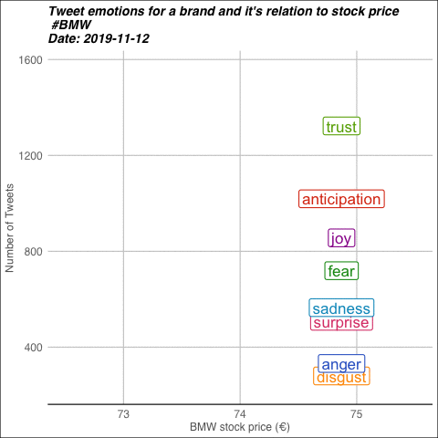

# tweet_animation
Animated chart of twitter sentiment and stock price change




## Installation

```
git clone https://github.com/jorgebmann/tweet_animation
```
A twitter developer account is needed to stream tweets. Copy and paste your app name, secret key, etc. in the token section of the scirpt. 
You can apply here: https://developer.twitter.com/en

## Usage

1.)	Run get_tweets.R to download recent tweets concerning a car brand (here: BMW). 
2.)	Run get_stock_values.R to receive stock price changes over time
3.)	Do the graph animation with animate_tweets_stocks.R


## What is does

Tweets are downloaded and preprocessed, including removing of punctuation, non-words, stop-words, tokenizing, and stemming. Next, a sentiment analysis is applied for each tweet. This analysis is based on the NRC word-emotion lexicon (http://saifmohammad.com/WebPages/lexicons.html). The output of this script is a file with sentiment values (positive, negative) and emotion values (anger, anticipation, disgust, fear, joy, sadness, surprise, trust) for each tweet.
Thereafter, stock price movements for the car brand are downloaded and merged by date with sentiment and emotion values.
Finally, these values are plotted and animated. 

## Contributing
Pull requests are welcome. For major changes, please open an issue first to discuss what you would like to change.

Please make sure to update tests as appropriate.

## License
[MIT](https://choosealicense.com/licenses/mit/)

